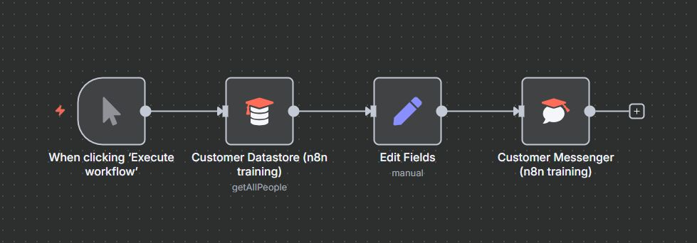

# 🤖 Customer Support Data Processing with n8n

This project contains a customer support data processing workflow built using n8n. It demonstrates how to retrieve customer information from a datastore, transform the data, and send personalized messages to customers.

## 🚀 Features

- **Manual Trigger**: Execute workflow on demand for testing and processing
- **Customer Data Retrieval**: Fetches customer records from n8n training datastore
- **Data Transformation**: Restructures customer data into standardized format
- **Personalized Messaging**: Generates and sends custom messages to customers
- **Scalable Processing**: Handles multiple customer records efficiently

## 🛠 Workflow Overview

The workflow consists of four main nodes:

1. **Manual Trigger** – Initiates the workflow execution
2. **Customer Datastore** – Retrieves customer records (limited to 10)
3. **Edit Fields** – Transforms and standardizes customer data
4. **Customer Messenger** – Sends personalized messages to customers

## 📂 Repository Structure

```
├── Customer Support Data.json   # Exported n8n workflow
├── README.md                    # Documentation
```

## 🔧 Setup Instructions

1. **Clone this repository:**
   ```bash
   git clone https://github.com/your-username/customer-support-data.git
   cd customer-support-data
   ```

2. **Import the workflow** (`Customer Support Data.json`) into your n8n instance.

3. **Configure your n8n training environment** with customer datastore access.

4. **Activate the workflow** and start processing customer support data! 🎉

## 📸 Workflow Preview



## 🙌 Acknowledgments

Special thanks to:

- **n8n** for the no-code/low-code automation platform
- **n8n Training** for providing the customer datastore and messenger components
- **Customer Support Teams** for inspiring this workflow

## 🏗️ Architecture Diagram

```
    A[Manual Trigger] --> B[Customer Datastore]
    B --> C[Edit Fields]
    C --> D[Customer Messenger]
```

## 💬 Data Processing in Action

The workflow processes customer data by:
1. Retrieving customer records with name, email, notes, and country
2. Transforming data into standardized fields (customer_name, customer_email, customer_query, customer_address)
3. Generating personalized messages for each customer
4. Sending messages through the customer messenger system

## 🔍 Use Cases

- **Customer Onboarding**: Welcome new customers with personalized messages
- **Support Follow-ups**: Send automated responses to customer queries
- **Data Standardization**: Normalize customer data from various sources
- **Bulk Messaging**: Process multiple customer records simultaneously

## 📊 Data Flow

1. **Input**: Customer records from datastore
2. **Processing**: Data transformation and field mapping
3. **Output**: Personalized customer messages
4. **Delivery**: Automated message sending via messenger system
